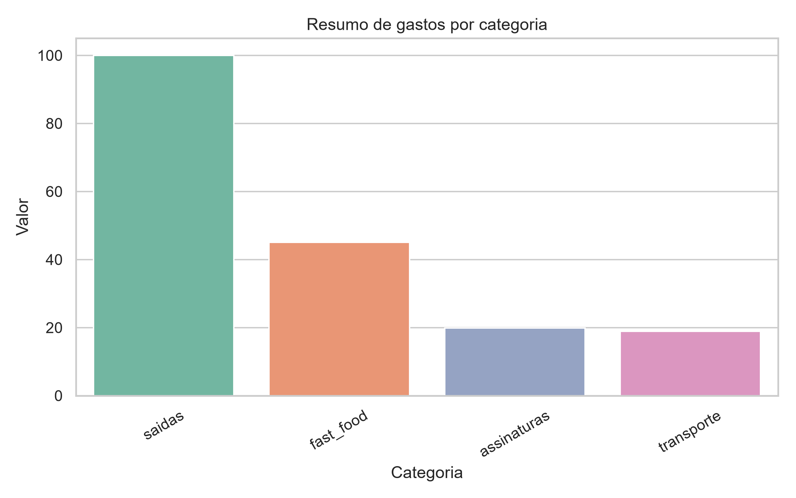
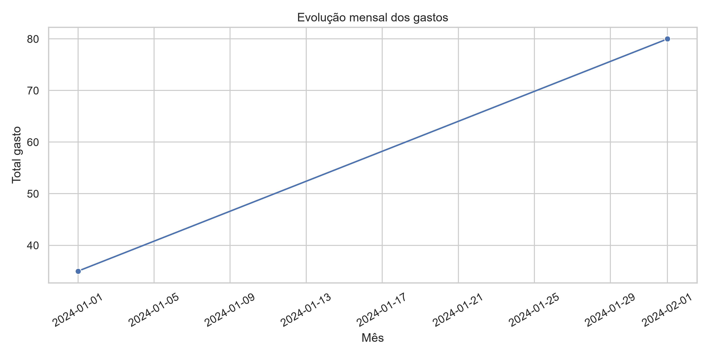

# 📊 Rastreador de Gastos Pessoais

Aplicação web em Python + Streamlit para transformar extratos bancários brutos em um dashboard único, com categorização automática e visão consolidada de gastos.


## 🎥 Demonstração visual


### Exemplo de saída (gráfico)


### Exemplo de saída (evolução mensal)


## ✨ O que o projeto faz

- Importa múltiplos arquivos de extrato (`.csv`, `.xlsx`, `.xls`, `.pdf`, `.docx`, `.txt`) de uma vez.
- Tenta identificar automaticamente colunas de **data**, **descrição** e **valor**.
- Usa parsing mais flexível para lidar com formatos diferentes de PDF, texto livre e documentos do Word.
- Detecta automaticamente o banco/provedor com base no conteúdo e no nome do arquivo, aplicando estratégia mais adequada para cada caso.
- Aplica categorização automática por palavras-chave (mercado, transporte, assinaturas etc.).
- Consolida tudo em uma tabela única com origem do arquivo.
- Exibe métricas e gráfico de gastos por categoria.
- Para PDFs sem tabela estruturada, usa fallback com OCR (quando configurado).

## 🏆 Resultados entregues

- Consolidação de múltiplos extratos em uma única base de análise.
- Redução de trabalho manual para classificar gastos recorrentes.
- Visualização imediata de total gasto, maior compra e distribuição por categoria.
- Suporte a casos comuns de extratos em PDF com estrutura inconsistente.
- Melhor resiliência para documentos de bancos como Mercado Pago, Nubank, Itaú, Santander, Bradesco, Caixa e outros.

## 🔄 Melhorias recentes

- Parser adaptado para diferentes layouts de PDF, incluindo conteúdos mais "soltos" ou mal estruturados.
- Suporte a arquivos `.docx` e `.txt` para entrada de extratos.
- Detecção automática do banco/provedor para escolher a estratégia de extração mais adequada.
- Normalização de linhas e limpeza de descrições/valores para reduzir ruído.

## 🧱 Stack

- Python
- Streamlit
- Pandas
- Matplotlib
- pdfplumber
- (Opcional para OCR) `pdf2image` + `pytesseract`

## 📁 Estrutura principal

- `app.py`: aplicação web principal.
- `requirements.txt`: dependências base.
- `test_rastreador.py`: testes existentes do projeto.

## ▶️ Como executar

1. Criar/ativar ambiente virtual:

```bash
python -m venv .venv
.venv\Scripts\activate
```

2. Instalar dependências:

```bash
pip install -r requirements.txt
```

3. Iniciar o app:

```bash
streamlit run app.py
```

## 🧾 Formatos suportados

- CSV (`.csv`)
- Excel (`.xlsx`, `.xls`)
- PDF (`.pdf`)

## 🔎 OCR para PDF escaneado (opcional)

Se seus PDFs forem imagem/escaneados, instale também:

```bash
pip install pdf2image pytesseract
```

Além disso, no Windows, é necessário ter:

- **Tesseract OCR** instalado
- **Poppler** instalado (para conversão de páginas PDF em imagem)

O app tenta detectar caminhos comuns automaticamente.

## ⚠️ Limitações atuais

- A categorização é baseada em regras fixas de palavras-chave.
- Alguns layouts de extrato podem exigir ajustes nas regras de extração.

## 📌 Próximos passos sugeridos

- Exportação do extrato unificado para CSV.
- Edição manual de categorias pela interface.
- Regras de categorização externas (arquivo de configuração).
- Filtros por período, conta e categoria.
